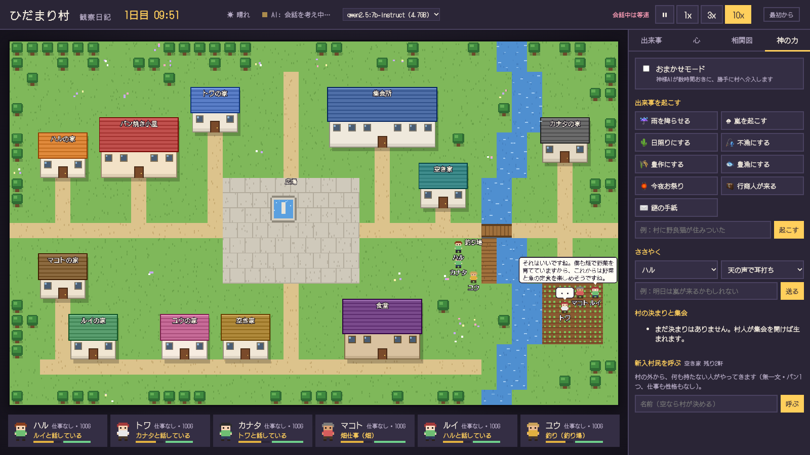

# ひだまり村 観察日記

AI の村人が暮らす、小さなドット絵の村を見守るアプリです。

村人は最初、名前と見た目しか違いません。仕事も性格も秘密も決まっていません。
食べ物を作り、売り買いし、約束し、ときには盗み、噂を広め、集会を開いて決まりを作り……
そうした暮らしの中から、ひとりひとりの個性や、村の社会が生まれていきます。

あなたは神さまとして、それを眺めたり、ときどき手を出したりできます
（雨を降らせる、盗賊を呼ぶ、天の声でささやく、など）。



## はじめかた

1. [リリース](../../releases/latest) から、お使いのパソコン用のファイルをダウンロードします。
   - Mac（M1 以降）… `aarch64.dmg`
   - Mac（Intel）… `x64.dmg`
   - Windows … `x64-setup.exe`
2. 開いてインストールします。
   - **Mac**：dmg を開いて、ひだまり村をアプリケーションフォルダへドラッグします。
     初めて開くとき「開発元を確認できない」と出たら、アプリを右クリック →「開く」→「開く」を選んでください。
   - **Windows**：「Windows によって PC が保護されました」と出たら、「詳細情報」→「実行」を選んでください。
3. 起動すると「AIの準備」の画面が出ます。案内に沿って進めると、
   村人が考えるための AI（[Ollama](https://ollama.com) とモデル）が自動でダウンロードされます。
   - Ollama：約200MB（無料）
   - モデル：ふつう 約4.7GB／軽い 約1.9GB（どちらか一つ）
   - ダウンロードは最初の一回だけです。

AI はすべてあなたのパソコンの中で動きます。会話がインターネットに送られることはなく、利用料もかかりません。

### 動かすのに必要なもの

- Mac（macOS 11 以降）または Windows 10／11
- メモリ 8GB 以上（16GB 以上がおすすめ）
- 空き容量 約7GB

AI を使わずに「ルールだけで暮らす村」を眺めることもできます（準備の画面で「AIなしで始める」）。

## あそびかた

- 時間は、あなたが見ている間だけ進みます。右上で速さを変えられます。
- **出来事**タブ：村で起きたこと。盗みや暴力は紫、集会は水色で出ます（神さまなので、誰がやったかも分かります）。
- **心**タブ：村人をクリックすると、その人の自己像・望み・今日の予定・隠していること・知っていることが見られます。
- **相関図**タブ：村人どうしの気持ち。
- **社会**タブ：組織・決まり・集会の記録・事件簿・遺品・お墓。
- **神の力**タブ：天気や出来事を起こす、村人にささやく（天の声・噂・悪魔のささやき）、届いた祈りに応える、新しい村人を呼ぶ。

## 開発する人へ

```sh
npm install
npm run dev          # ブラウザ版（http://localhost:5173 。Ollama を別に起動しておく）
npm run desktop      # デスクトップ版（Tauri。Rust が必要）
npm run package:mac  # Mac 用の dmg を作る
npm run simulate -- 20 1   # AI なしで 20 日分を早回し（シード 1）
```

- 画面：TypeScript + Canvas（Vite）
- デスクトップ版：Tauri 2
- AI：Ollama（既定のモデルは qwen2.5:7b-instruct。画面上部で切り替えられます）
- 村の仕組みの設計は [docs/society-draft.md](docs/society-draft.md) にあります。

## ライセンス

MIT
